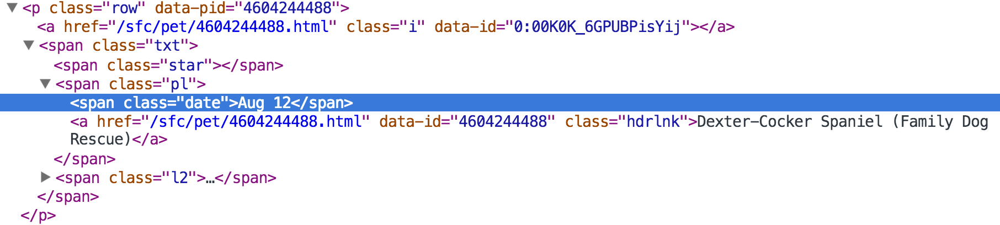
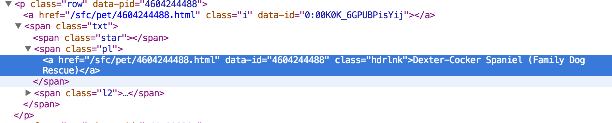

## Nokogiri, regex and rspec lab with Craigslist

Your task for tonight is to write a __Puppy Scraper__. Your scraper will search craigslist for all pets in the SF area and use regex to return the link (href) and text for any posting that matches the words "pup", ""puppy", "puppies" and "dog".  In addition, make sure the puppy scraper only returns results from August 12th


### Requirements
1. Use Nokogiri to scrape craigslist using `today.html`
2. Use regex to match the text you search for ("pup", "puppy", "dog") and make sure you are only returning results from August 12th
3. Test your methods and regular expressions with rspec

### Bonus 
1. Only return dog's who have an image in their description (hint: look for a span with the class of "p")
2. Make sure your result does not any links with the words "house", item" or "boots" 
3. Make sure your result does not include any rescue dogs

## Solution Talk

We first look inside the html for the Craigslist 

* Row Date 
	* 

* Row Link
	* 


## Getting Started In Chrome Console

Any good scrapping experience starts with a hefty amount of inspection in the chrome console. Sure enough, taking our inspiration above from the Chrome console we try

```
document.querySelectorAll(".row")
```
and retrieve all the rows (let's hold off on retrieving the `date` for a moment). Similarly, the following shows that we can retrieve all the links.

```
var rows = document.querySelectorAll(".row");

for (var i = 0; i < rows.length; i++) {
	var link = rows[i].querySelector(".hdrlnk");
	console.log(link)
}

```

We need to filter the rows by `date` and not just grab all the links:

```
var rows = document.querySelectorAll(".row");

var results = [];
// Filter results by date
for (var i = 0; i < rows.length; i++) {
	var dateEl = rows[i].querySelector(".date");
	var dateText = dateEl.innerHTML;
	if ( dateText.match("Aug 12") ) {
		results.push(rows[i]);
	}
}

```

If we wanted to we could then filter this based on some regex


```
// our case insensitive regex for dogs
var regex = /puppy|pup|dog/i
var filteredResults = [];

for (var i = 0; i < results.length; i++) {
	var link = results[i].querySelector(".hdrlnk")

	if (link.innerHTML.match(regex)) {
		filteredResults.push(link);
	}
}

```

